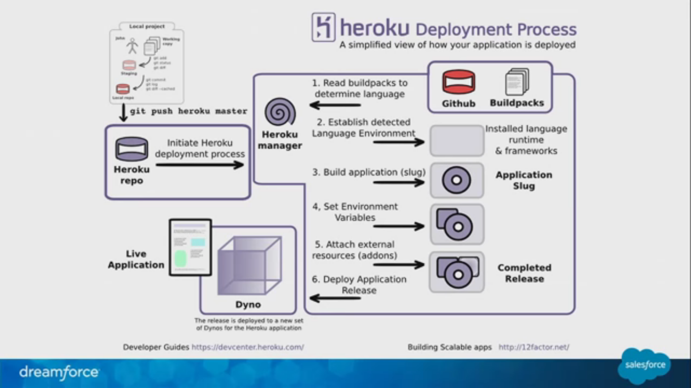
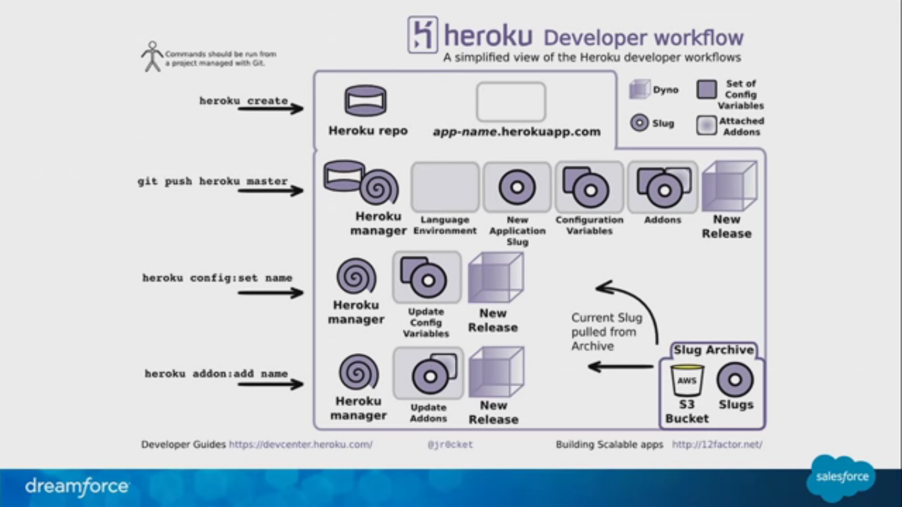

==========
Heroku
==========

App deployment platform so you can focus on building webapp.

Git support
==============

Heroku can deploy app using git.

git push heroku master

Contiuous Deployment
======================

Develop locally->deploy on heroku-> get feedback

What happens
============

when you push your code it goes through 

- heroku manager
- there it setups a language environment for compilation and execution
- then after compilation we get **slug** (compiled version of app) 
- then other services are configured like database that our app needs
- finally the app is released

heroku deployment process
---------------------------

	Deployment

Heroku developer workflow
---------------------------

	Developer workflow

 
